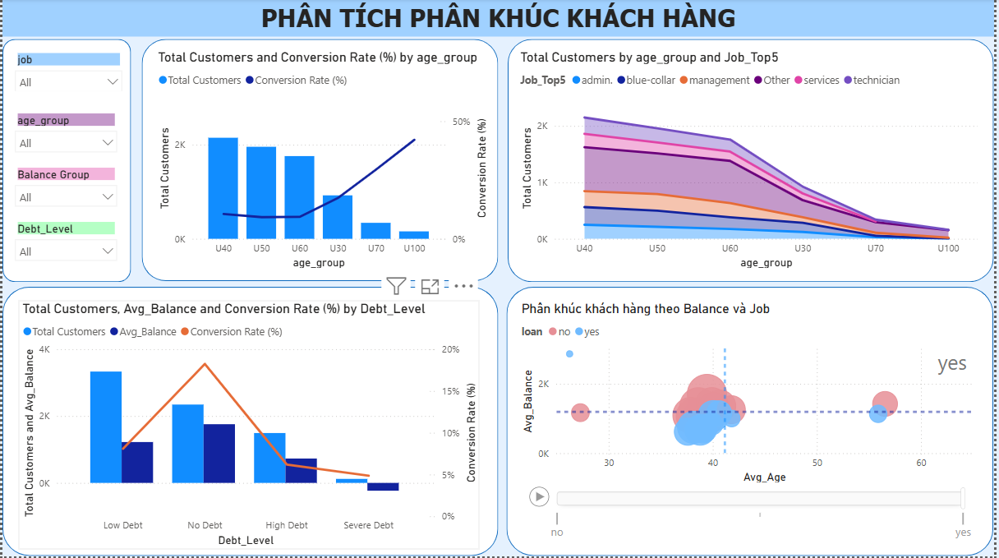
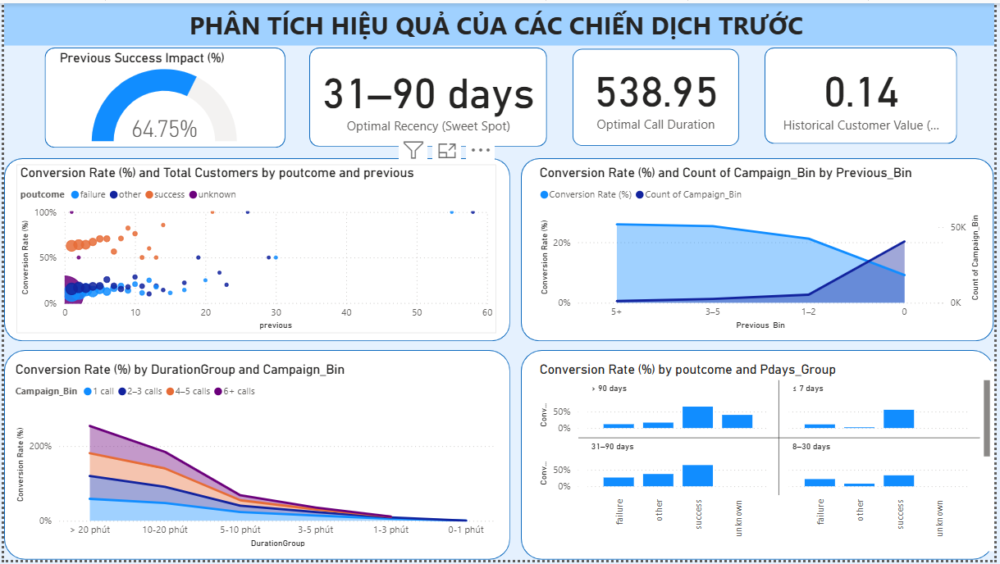

# 🏦 Bank Marketing Campaign Analysis & Customer Segmentation

<p align="center">
  
  
  
  
  
  
</p>

---

## 🔍 What This Project Does

A bank ran a phone-based marketing campaign targeting ~45,000 customers to sell term deposit subscriptions — but only **~11% converted**. This project answers three business questions:

1. **Who is likely to subscribe?** → Feature selection to find the top predictors
2. **What customer types exist?** → Unsupervised segmentation to find high-potential groups
3. **What patterns drive conversion?** → Association rule mining for actionable campaign rules

The full pipeline follows the **CRISP-DM methodology** and ends with an interactive **Power BI dashboard** built for non-technical stakeholders.

---

## 💡 Key Results

| Finding | Detail |
|---|---|
| **Top predictor** | `duration` (call length) — longest calls convert at 3× the average rate |
| **#2 predictor** | `balance` — customers with higher savings are more receptive |
| **Best segment** | Cluster of older, higher-balance customers with prior successful contact |
| **Actionable rule** | Customers contacted ≤ 3 times + prior success → significantly higher conversion |
| **Feature agreement** | Random Forest and Mutual Information both rank the same top 5 features |

---

## 🔄 Analysis Pipeline

```
1. Business Understanding    Define the problem as a segmentation + conversion task
         ↓
2. Exploratory Data Analysis  Distribution, correlation, class imbalance (89% / 11%)
         ↓
3. Data Preprocessing         Encoding · Log Transformation · Feature Discretization
         ↓
4. Feature Selection          Random Forest Importance + Mutual Information → Top 5 features
         ↓
5. Customer Segmentation      K-Means Clustering (K=4, validated via Elbow Method)
         ↓
6. Pattern Mining             Association Rules: Support · Confidence · Lift
         ↓
7. Visualization              Interactive Power BI Dashboard for business stakeholders
```

---
## 📊 Power BI Dashboard

### Preview

<p align="center">
  
</p>

The dashboard is structured into three main analytical views, each targeting a specific business dimension:

### 1. Campaign Overview
Provides a high-level summary of campaign metrics, timeline trends, and primary contact touchpoints.

* **Core KPI Cards:**
    * **Total Customers:** 2,149
    * **Average Campaign:** 1.98 contacts/customer
    * **Average Duration:** 244.65 seconds
    * **Total Subscriptions:** 677
    * **Conversion Rate:** 12.6%
* **Key Visualizations & Insights:**
    * **Monthly Performance:** May has the highest influx of total customers reached, but conversion rates (%) strongly peak later in the year, hitting their highest performance between **August and November** (surpassing 30-35%).
    * **Campaign Fatigue:** Conversion rates drop drastically as the number of contact calls increases. A single call yields the highest conversion (~14%), which steadily declines down to less than 4% for customers contacted 6+ times.
    * **Contact Channels:** Cellular contact methods achieve a slightly higher conversion rate compared to traditional telephone lines.

<p align="center">
  
</p>

### 2. Customer Segmentation Analysis
Delves into customer demographics, professional backgrounds, and financial behaviors to pinpoint ideal target audiences.

* **Interactive Slicers:** Filter data dynamically by *Job*, *Age Group*, *Balance Group*, and *Debt Level*.
* **Key Visualizations & Insights:**
    * **Age Demographics:** The largest volume of customers falls under the **U40, U50, and U60** groups. However, conversion rates take a sharp upward trajectory in older demographics (**U70 and U100**), representing a highly responsive niche market.
    * **Financial Profiles & Debt Impact:** Customers classified with **"No Debt"** demonstrate significantly higher conversion rates compared to those with "Low Debt" or "High Debt". 
    * **Balance vs. Age Cluster Map:** An interactive breakdown analyzing average age against average balance shows that lower-risk profiles (No/Low Loans) with stable balances cluster tightly around the 35–45 age range.

<p align="center">
  
</p>

### 3. Previous Campaign Analysis
Evaluates historical patterns and customer journey touchpoints to define optimal thresholds for call timings and intervals.

* **Predictive & Optimization KPIs:**
    * **Previous Success Impact:** 64.75% conversion retention from historically successful customers.
    * **Optimal Recency (Sweet Spot):** **31–90 days** since the last campaign contact.
    * **Optimal Call Duration:** **538.95 seconds** (~9 minutes) is identified as the prime window to secure a subscription.
    * **Historical Customer Value:** 0.14
* **Key Visualizations & Insights:**
    * **Historical Outings (`poutcome`):** Customers who previously yielded a "success" maintain a distinctly high conversion rate regardless of minor variations in campaign frequency.
    * **Duration Group vs. Campaign Bin:** Longer durations (>20 minutes) matched with a lower frequency of total calls (1-3 calls) display an exponential conversion probability, highlighting that quality interaction beats volume outreach.
    * **Recency (Pdays Group):** The **31–90 days** interval combined with a previous "success" outcome serves as the absolute highest-converting window across all historical timelines.
### 🔗 Links
| | |
|---|---|
| **Live Dashboard** | [View on Power BI Service](https://app.powerbi.com/links/t1IOABFPjN?ctid=2dff09ac-2b3b-4182-9953-2b548e0d0b39&pbi_source=linkShare) |
| **Download .pbix** | [Download from SharePoint](https://uithcm-my.sharepoint.com/:u:/g/personal/23521562_ms_uit_edu_vn/IQDGxOhayuSFR7Di9KsFMCQsAfJBeHdNDqCjCOIbkzKKpnY?e=WqhSQs) |

---

## 🛠️ Skills Demonstrated

| Area | What I Did |
|---|---|
| **Data Analysis** | EDA on 45K+ records — distributions, outliers, correlations, class imbalance |
| **Feature Engineering** | Log transformation to fix skewness, discretization for rule mining |
| **Machine Learning** | Random Forest for feature importance; K-Means for unsupervised segmentation |
| **Statistical Methods** | Mutual Information, Elbow Method, Association Rule Mining |
| **Data Visualization** | Power BI dashboard with DAX measures, slicers, segment-level breakdowns |
| **Business Thinking** | Translated model outputs into campaign strategy recommendations |

---

## 📁 Project Structure

```
Bank-Marketing-Customer-Analysis/
├── assets/                         # Screenshots and dashboard preview images
├── dashboard/                      # Power BI dashboard files and exports
├── data/                           # Raw dataset files
│   ├── test.csv
│   └── train.csv
├── notebook/                       # Jupyter notebooks for analysis steps
│   ├── eda_before_preprocessing.ipynb
│   ├── eda_after_preprocessing.ipynb
│   ├── preprocessing.ipynb
│   ├── feature_selection.ipynb
│   └── pattern_analysis_evaluate.ipynb
├── report/                         # Final report and summary artifacts
└── README.md                       # Project overview and pipeline summary
```

---

## 📂 Dataset

**[Banking Dataset – Marketing Targets](https://www.kaggle.com/datasets/prakharrathi25/banking-dataset-marketing-targets)** — Kaggle

| | |
|---|---|
| Records | ~45,000 customer interactions |
| Features | 17 (demographic, financial, campaign history) |
| Target | `y` — did the customer subscribe? (`yes` / `no`) |
| Class balance | ~89% No · ~11% Yes |

---

## ⚙️ How to Run

```bash
# 1. Clone the repo
git clone https://github.com/thybui1903/Bank-Marketing-Customer-Analysis.git
cd Bank-Marketing-Customer-Analysis

# 2. Install dependencies
pip install pandas numpy scikit-learn matplotlib seaborn mlxtend jupyter

# 3. Add dataset
# Download from Kaggle and place CSV files inside Final Project/

# 4. Run notebooks in order
# EDA → Preprocessing → Feature_Selection → Clustering → Pattern_Mining

# 5. Open Dashboard.pbix in Power BI Desktop
```

---

## 👤 About the Author

**Bui Tran Thy Thy** — Data Science student at UIT VNU-HCM (GPA: 8.69/10)

Seeking a **Data Analyst / Data Scientist internship** where I can apply end-to-end analytical skills to real business problems.

[](https://github.com/thybui1903)
[](https://www.linkedin.com/in/thybui1903)
[](mailto:thybui1903qn@gmail.com)
