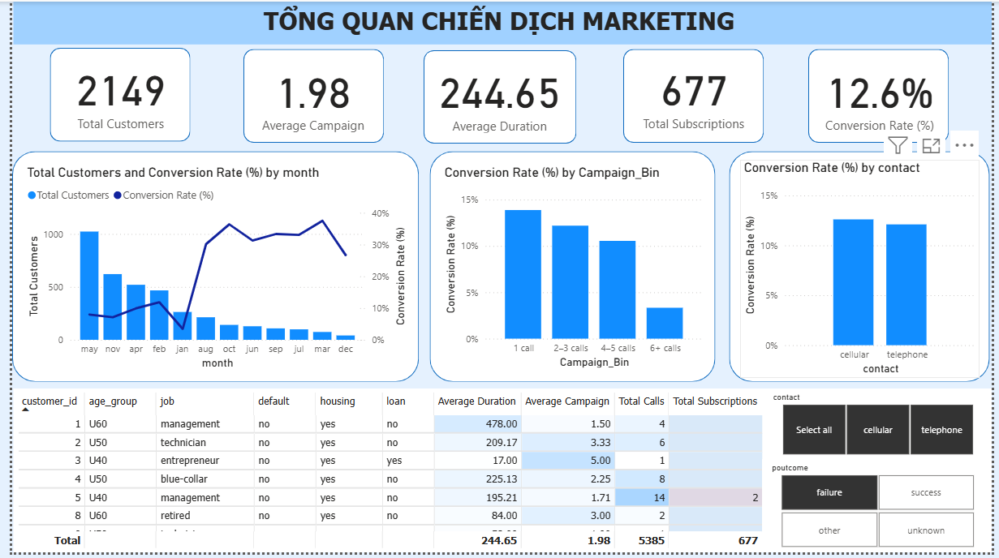

# 🏦 Bank Marketing Campaign Analysis & Customer Segmentation

<p align="center">
  
</p>

<p align="center">
  
  
  
  
  
  
</p>

---

## 🔍 What This Project Does

A bank ran a phone-based marketing campaign targeting ~45,000 customers to sell term deposit subscriptions — but only **~11% converted**. This project answers three business questions:

1. **Who is likely to subscribe?** → Feature selection to find the top predictors
2. **What customer types exist?** → Unsupervised segmentation to find high-potential groups
3. **What patterns drive conversion?** → Association rule mining for actionable campaign rules

The full pipeline follows the **CRISP-DM methodology** and ends with an interactive **Power BI dashboard** built for non-technical stakeholders.

---

## 📊 Dashboard Preview

> *Upload your dashboard screenshot as `assets/dashboard.png` and the preview image at the top will render automatically.*

---

## 💡 Key Results

| Finding | Detail |
|---|---|
| **Top predictor** | `duration` (call length) — longest calls convert at 3× the average rate |
| **#2 predictor** | `balance` — customers with higher savings are more receptive |
| **Best segment** | Cluster of older, higher-balance customers with prior successful contact |
| **Actionable rule** | Customers contacted ≤ 3 times + prior success → significantly higher conversion |
| **Feature agreement** | Random Forest and Mutual Information both rank the same top 5 features |

---

## 🔄 Analysis Pipeline

```
1. Business Understanding    Define the problem as a segmentation + conversion task
         ↓
2. Exploratory Data Analysis  Distribution, correlation, class imbalance (89% / 11%)
         ↓
3. Data Preprocessing         Encoding · Log Transformation · Feature Discretization
         ↓
4. Feature Selection          Random Forest Importance + Mutual Information → Top 5 features
         ↓
5. Customer Segmentation      K-Means Clustering (K=4, validated via Elbow Method)
         ↓
6. Pattern Mining             Association Rules: Support · Confidence · Lift
         ↓
7. Visualization              Interactive Power BI Dashboard for business stakeholders
```

---

## 🛠️ Skills Demonstrated

| Area | What I Did |
|---|---|
| **Data Analysis** | EDA on 45K+ records — distributions, outliers, correlations, class imbalance |
| **Feature Engineering** | Log transformation to fix skewness, discretization for rule mining |
| **Machine Learning** | Random Forest for feature importance; K-Means for unsupervised segmentation |
| **Statistical Methods** | Mutual Information, Elbow Method, Association Rule Mining |
| **Data Visualization** | Power BI dashboard with DAX measures, slicers, segment-level breakdowns |
| **Business Thinking** | Translated model outputs into campaign strategy recommendations |

---

## 📁 Project Structure

```
Bank-Marketing-Customer-Analysis/
│
├── Final Project/
│   ├── EDA.ipynb                   # Exploratory Data Analysis
│   ├── Preprocessing.ipynb         # Cleaning, encoding, transformation
│   ├── Feature_Selection.ipynb     # Random Forest + Mutual Information
│   ├── Clustering.ipynb            # K-Means + Elbow Method
│   ├── Pattern_Mining.ipynb        # Association rule extraction
│   └── Dashboard.pbix              # Power BI dashboard
│
├── assignment/                     # Coursework supporting materials
├── assets/                         # Screenshots and images for README
└── README.md
```

> ⚠️ Update notebook filenames above to match your actual files.

---

## 📂 Dataset

**[Banking Dataset – Marketing Targets](https://www.kaggle.com/datasets/prakharrathi25/banking-dataset-marketing-targets)** — Kaggle

| | |
|---|---|
| Records | ~45,000 customer interactions |
| Features | 17 (demographic, financial, campaign history) |
| Target | `y` — did the customer subscribe? (`yes` / `no`) |
| Class balance | ~89% No · ~11% Yes |

---

## ⚙️ How to Run

```bash
# 1. Clone the repo
git clone https://github.com/thybui1903/Bank-Marketing-Customer-Analysis.git
cd Bank-Marketing-Customer-Analysis

# 2. Install dependencies
pip install pandas numpy scikit-learn matplotlib seaborn mlxtend jupyter

# 3. Add dataset
# Download from Kaggle and place CSV files inside Final Project/

# 4. Run notebooks in order
# EDA → Preprocessing → Feature_Selection → Clustering → Pattern_Mining

# 5. Open Dashboard.pbix in Power BI Desktop
```

---

## 👤 About the Author

**Bui Tran Thy Thy** — Data Science student at UIT VNU-HCM (GPA: 8.69/10)

Seeking a **Data Analyst / Data Scientist internship** where I can apply end-to-end analytical skills to real business problems.

[](https://github.com/thybui1903)
[](https://www.linkedin.com/in/thybui1903)
[](mailto:thybui1903qn@gmail.com)
